# Recnik - Architecture Documentation

## Overview

Recnik has been redesigned as a microservices architecture following 12-factor app principles and clean architecture patterns. This document describes the current architecture, services, and their interactions.

## Architecture Principles

- **Microservices Design**: Each domain separated into its own service
- **12-Factor App Compliance**: Configuration via environment variables, stateless processes, JSON logging
- **MVC Pattern**: Models, Views (REST APIs), Controllers for business logic
- **Clean Architecture**: Separation of concerns, dependency inversion
- **Observability**: Structured logging, Prometheus metrics, health checks
- **Containerization**: All services dockerized with proper health checks

## System Architecture

```mermaid
graph TB
    %% User Interface
    User[👤 User] --> Frontend[🖥️ Frontend<br/>React App<br/>:3000]

    %% API Gateway
    Frontend --> Gateway[🚪 API Gateway<br/>Request Router<br/>:3001]

    %% Core Microservices
    Gateway --> Auth[🔐 Auth Service<br/>User Management<br/>:3002]
    Gateway --> Vocab[📚 Vocabulary Service<br/>Words & Categories<br/>:3003]
    Gateway --> Practice[🎯 Practice Service<br/>Learning Sessions<br/>:3004]
    Gateway --> News[📰 News Service<br/>Content Aggregation<br/>:3005]

    %% Background Services
    ImageSync[🖼️ Image Sync Service<br/>Background Worker] --> Redis
    CacheUpdater[⚡ Cache Updater<br/>News Background Worker] --> Redis
    QueuePopulator[📋 Queue Populator<br/>Image Queue Management] --> Redis
    QueuePopulator --> Postgres

    %% Infrastructure
    Auth --> Postgres[(🗄️ PostgreSQL<br/>:5432)]
    Vocab --> Postgres
    Practice --> Postgres
    News --> Redis[(⚡ Redis<br/>:6379)]
    ImageSync --> Redis

    %% Monitoring
    Prometheus[📊 Prometheus<br/>Metrics Collection<br/>:9090] --> Gateway
    Prometheus --> Auth
    Prometheus --> Vocab
    Prometheus --> Practice
    Prometheus --> News

    Grafana[📈 Grafana<br/>Dashboards<br/>:3100] --> Prometheus

    %% External Services
    Vocab -.-> OpenAI[🤖 OpenAI API<br/>Text Processing]
    ImageSync -.-> Unsplash[📸 Unsplash API<br/>Image Search]
    News -.-> RSS[📡 RSS Feeds<br/>News Sources]

    %% Styling
    classDef service fill:#e1f5fe,stroke:#01579b,stroke-width:2px
    classDef infrastructure fill:#f3e5f5,stroke:#4a148c,stroke-width:2px
    classDef external fill:#fff3e0,stroke:#e65100,stroke-width:2px
    classDef monitoring fill:#e8f5e8,stroke:#2e7d2e,stroke-width:2px

    class Auth,Vocab,Practice,News,Gateway service
    class Postgres,Redis infrastructure
    class OpenAI,Unsplash,RSS external
    class Prometheus,Grafana monitoring
```



## Service Details

### 1. Authentication Service (:3002)

**Purpose**: User management, authentication, and authorization

**Technology Stack**:

- Flask + SQLAlchemy
- JWT for authentication
- PostgreSQL for data persistence
- Prometheus metrics

**Endpoints**:

- `POST /api/auth/register` - User registration
- `POST /api/auth/login` - User login
- `GET /api/auth/me` - Get current user
- `GET /api/settings` - Get user settings
- `PUT /api/settings` - Update user settings
- `GET /health` - Health check
- `GET /metrics` - Prometheus metrics

**Database Tables**:

- `users` - User accounts
- `settings` - User preferences and API keys

### 2. Vocabulary Service (:3003)

**Purpose**: Words, categories, and text processing management

**Technology Stack**:

- Flask + SQLAlchemy
- OpenAI API integration
- PostgreSQL for data persistence
- Redis for caching
- Prometheus metrics

**Endpoints**:

- `GET /api/categories` - List categories
- `GET /api/words` - Get user's words
- `POST /api/words` - Add words to vocabulary
- `POST /api/process-text` - Process Serbian text with AI
- `GET /api/top100/categories/<id>` - Get top 100 words by category
- `POST /api/top100/add` - Add top 100 words to vocabulary
- `GET /health` - Health check
- `GET /metrics` - Prometheus metrics

**Database Tables**:

- `categories` - Word categories
- `words` - Serbian-English word pairs
- `user_vocabulary` - User's personal vocabulary

### 3. Practice Service (:3004)

**Purpose**: Learning sessions, practice exercises, and progress tracking

**Technology Stack**:

- Flask + SQLAlchemy
- OpenAI API for example sentences
- PostgreSQL for data persistence
- Prometheus metrics

**Endpoints**:

- `GET /api/practice/words` - Get words for practice
- `POST /api/practice/start` - Start practice session
- `POST /api/practice/submit` - Submit practice result
- `POST /api/practice/complete` - Complete practice session
- `POST /api/practice/example-sentence` - Generate example sentence
- `GET /api/stats` - Get user statistics
- `GET /health` - Health check
- `GET /metrics` - Prometheus metrics

**Database Tables**:

- `practice_sessions` - Practice session records
- `practice_results` - Individual question results

### 4. News Service (:3005)

**Purpose**: Serbian news aggregation and content delivery

**Technology Stack**:

- Flask
- Redis for caching
- RSS feed parsing
- Web scraping for full articles
- Prometheus metrics

**Endpoints**:

- `GET /api/news` - Get cached news articles
- `GET /api/news/sources` - Get available news sources
- `GET /health` - Health check
- `GET /metrics` - Prometheus metrics

**Background Services**:

- Cache Updater: Fetches and caches news articles from RSS feeds

### 5. API Gateway (:3001)

**Purpose**: Request routing, load balancing, and API composition

**Technology Stack**:

- Flask
- Service discovery
- Request forwarding
- Authentication middleware
- Prometheus metrics

**Features**:

- Route requests to appropriate microservices
- JWT token validation
- Request/response logging
- Circuit breaker pattern
- Rate limiting

## Background Services

### Image Sync Service

**Purpose**: Fetch and cache images for vocabulary words

**Features**:

- Unsplash API integration with rate limiting
- Redis-based job queue
- Background image processing
- Automatic retry logic
- Detailed logging

### Cache Updater

**Purpose**: Keep news cache fresh with latest articles

**Features**:

- Multiple RSS feed support
- Full article content extraction
- Scheduled updates
- Error handling and retries

### Queue Populator

**Purpose**: Populate image processing queue with vocabulary words

**Features**:

- Database integration
- Priority-based queuing
- Continuous monitoring
- Statistics tracking

## Data Flow

### User Authentication Flow


### Vocabulary Processing Flow


### Practice Session Flow


## Monitoring and Observability

### Logging

All services implement structured JSON logging with the following fields:

- `timestamp`: ISO 8601 timestamp
- `level`: Log level (INFO, WARN, ERROR)
- `service`: Service name
- `message`: Log message
- `request_id`: Unique request identifier
- `user_id`: User context (when available)
- `endpoint`: API endpoint
- `method`: HTTP method
- `ip`: Client IP address

Example log entry:

```json
{
  "timestamp": "2025-01-08T07:22:15Z",
  "level": "INFO",
  "service": "auth-service",
  "message": "User registered successfully",
  "request_id": "550e8400-e29b-41d4-a716-446655440000",
  "user_id": 123,
  "username": "testuser",
  "endpoint": "/api/auth/register",
  "method": "POST",
  "ip": "192.168.1.100"
}
```

### Metrics

Each service exposes Prometheus metrics at `/metrics`:

**Common Metrics**:

- `flask_http_request_total` - Total HTTP requests
- `flask_http_request_duration_seconds` - Request duration
- `flask_http_request_exceptions_total` - Request exceptions
- `service_info` - Service information

**Custom Metrics**:

- Auth Service: `auth_registrations_total`, `auth_logins_total`
- Vocabulary Service: `words_processed_total`, `vocabulary_size`
- Practice Service: `practice_sessions_total`, `practice_accuracy`
- News Service: `articles_cached_total`, `cache_hit_ratio`

### Health Checks

All services implement health checks at `/health`:

- Database connectivity
- External service availability
- Service-specific health indicators

## Deployment

### Environment Variables

Each service uses environment variables for configuration:

**Common Variables**:

- `DATABASE_URL` - PostgreSQL connection string
- `REDIS_URL` - Redis connection string
- `JWT_SECRET_KEY` - JWT signing secret
- `PORT` - Service port
- `ENVIRONMENT` - Deployment environment
- `LOG_LEVEL` - Logging level

**Service-Specific Variables**:

- `OPENAI_API_KEY` - OpenAI API key
- `UNSPLASH_ACCESS_KEY` - Unsplash API key
- `GRAFANA_PASSWORD` - Grafana admin password

### Docker Compose

The entire system can be deployed using Docker Compose:

```bash
# Start all services
docker-compose up -d

# Scale specific services
docker-compose up -d --scale vocabulary-service=3

# View logs
docker-compose logs -f auth-service

# Monitor metrics
open http://localhost:9090  # Prometheus
open http://localhost:3100  # Grafana
```

### Service Ports

- Frontend: 3000
- API Gateway: 3001
- Auth Service: 3002
- Vocabulary Service: 3003
- Practice Service: 3004
- News Service: 3005
- PostgreSQL: 5432
- Redis: 6379
- Prometheus: 9090
- Grafana: 3100

## Development Guidelines

### Adding New Services

1. Create service directory under `services/`
2. Implement MVC structure:
   - `models/` - Database models
   - `controllers/` - Business logic
   - `views/` - API endpoints (in main.py)
3. Add health check and metrics endpoints
4. Implement structured logging
5. Create Dockerfile and requirements.txt
6. Update docker-compose.yml
7. Add Prometheus scraping configuration
8. Update API Gateway routing

### Code Quality

- Use Black for code formatting
- Implement type hints
- Write unit tests for controllers
- Mock external API calls in tests
- Follow 12-factor app principles
- Use dependency injection for testability

### Security Considerations

- JWT tokens for authentication
- Input validation and sanitization
- Rate limiting on public endpoints
- Secrets management via environment variables
- Network isolation via Docker networks
- Regular security updates

## Future Improvements

1. **Service Mesh**: Implement Istio for advanced traffic management
2. **Event Sourcing**: Add event-driven architecture for better auditing
3. **CQRS**: Separate read/write models for better performance
4. **GraphQL**: Add GraphQL API for flexible data fetching
5. **Kubernetes**: Deploy on Kubernetes for better orchestration
6. **Distributed Tracing**: Add Jaeger for request tracing
7. **Auto-scaling**: Implement horizontal pod autoscaling
8. **CI/CD Pipeline**: Add automated testing and deployment
